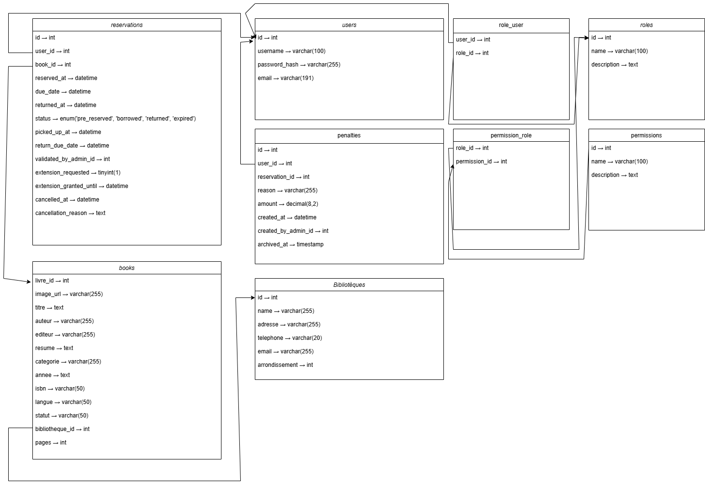

# 📚 Bibliothèque numérique – Système de gestion de bibliothèques

Bibliothèque numérique est une application complète de gestion de bibliothèques développée avec une architecture microservices utilisant React, Flask, Go et MySQL.

## 🏗️ Architecture

- **Frontend** : React.js (port 3000)
- **Backend API** : Flask/Python (port 5000)
- **Base de données** : MySQL 8.0 (port 3307)
- **Cron de purge** : Script Python (purge automatique des réservations expirées, toutes les 4h)
- **Logs d’activité** : Go/Gin (port 8080)
- **Base de données logs** : MongoDB (cloud)

## ⏰ Cron de purge automatique

Un service cron dédié exécute automatiquement la purge des réservations expirées toutes les 4 heures. Ce service fonctionne en tâche de fond dans un conteneur séparé et enregistre chaque action dans les logs d’activité (module "cron").

## 📋 Prérequis

- [Docker](https://www.docker.com/get-started) et Docker Compose installés
- Git pour cloner le projet

## 🚀 Installation et démarrage

### 1. Cloner le projet

```bash
git clone https://github.com/KxroTM/Bibolib.git
cd Bibolib
```

### 2. Démarrer tous les services

```bash
# Première fois : construire et démarrer
docker-compose up --build -d

# Ou simplement démarrer (si déjà construit)
docker-compose up -d
```

### 3. Vérifier que tous les services sont actifs

```bash
docker-compose ps
```

Vous devriez voir 4 conteneurs en cours d’exécution :

    - `bibolib-mysql` (healthy)
    - `bibolib-backend-1` (up)
    - `bibolib-frontend-1` (up)
    - `bibolib-activity_logs-1` (up)

## 🌐 Accès aux services

- **Application web** : http://localhost:3000
- **API backend** : http://localhost:5000
- **Service de logs** : http://localhost:8080
- **Base de données MySQL** : localhost:3307

## 🔁 Mise à jour après modification du code

Lorsque vous modifiez le code, utilisez ces commandes Docker Compose pour reconstruire et redéployer rapidement.

### Redémarrer un service sans rebuild

```bash
docker-compose restart frontend
```

### Voir les logs d’un service

```bash
docker-compose logs -f backend
```

### Réinitialiser complètement (supprime volumes et données)

```bash
docker-compose down -v
docker-compose up -d --build
```

# Schéma ##

Voici le schéma de la base de données utilisé par l'application :




